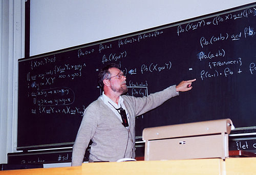

# Opdracht Functioneel Paradigma

"Program testing can be used to show the presence of bugs, but never to show their absence!"

**— Edsger Dijkstra**

| **Studentnaam:** | Nouri el Akel Rahhali |
| :--- | :--- |
| **student Nummer:** | 650002 |
| **Course:** | APP |
| **Datum:** | 29-09-2025 |
| **Docent:** | Dennis Breuker |
| **Versie:** | 1           |

---

## Inhoudsopgave

1. [Inleiding](#inleiding)
2. [Onderzoek](#onderzoek)
3. [Challenge](#challenge)
4. [Implementatie](#implementatie)
5. [Reflectie](#reflectie)
6. [Conclusie](#conclusie)
7. [Bronvermelding](#bronvermelding)

---

#